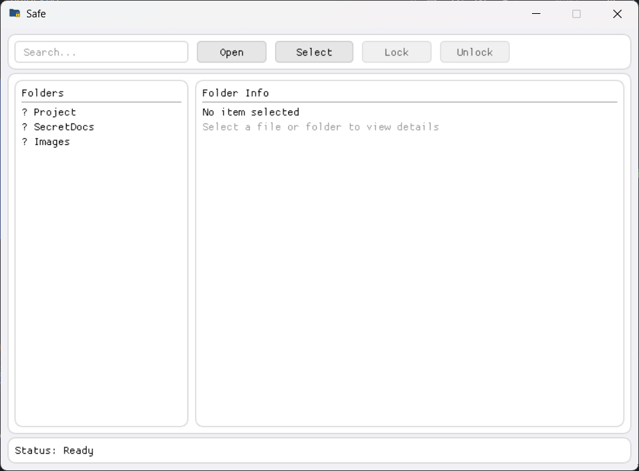
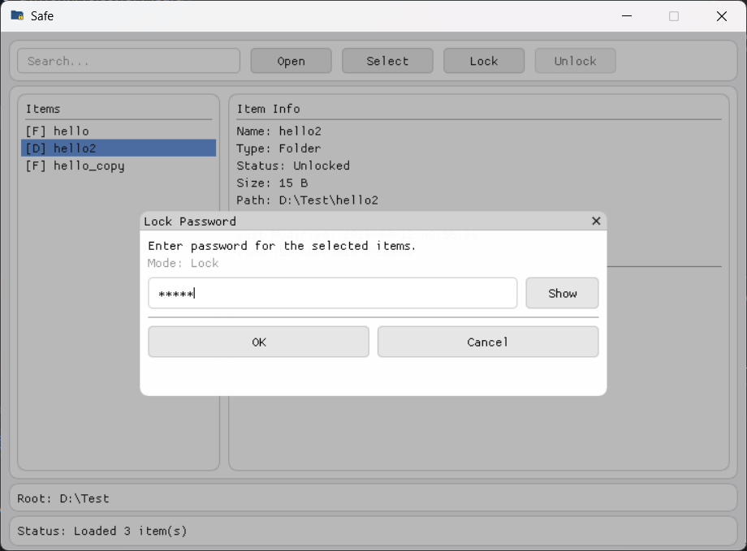
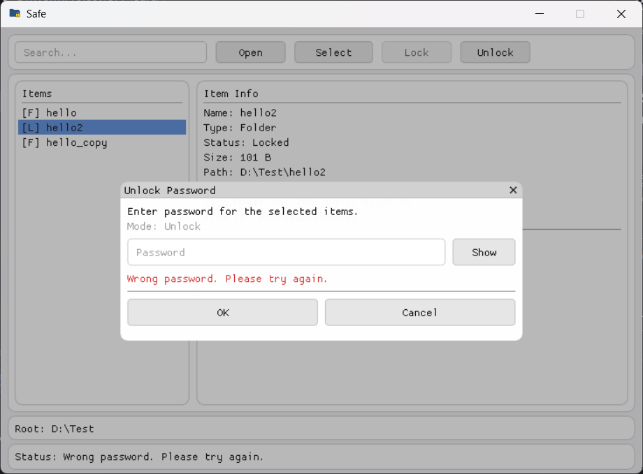

# Safe - How to Use

## 1. Open

1. Launch the app.
2. Click **Open** in the top bar.
3. Select a root folder from the system folder picker.
4. The sidebar is populated from real filesystem folders and files in the selected root.
5. While that root stays open, new/removed/renamed items are auto-refreshed live.

## 2. Select items

### Mouse only

1. **Single selection:** click an item.
2. **Button multi-select mode:** click **Select** (it becomes **Select ON**), then click items to add/remove them.
3. Click **Select ON** again to turn button multi-select mode off.

### Keyboard + mouse

1. **Ctrl + Click:** random (non-contiguous) selection/deselection.
2. **Shift + Click:** range selection from the current anchor to clicked item.

## 3. Lock

1. Select unlocked item(s).
2. Click **Lock**.
3. Enter a password in the lock popup.
4. The selected item (file or folder) is packed and encrypted into a `.safe` archive, and the original item is removed.
5. Press **Esc** to close the lock password popup.

## 4. Unlock

1. Select locked item(s).
2. Click **Unlock**.
3. Enter the same password used to lock.
4. The `.safe` archive is decrypted and the original file/folder content is restored to disk.
5. Press **Esc** to close the unlock password popup.

## 5. Search

1. Use the **Search...** box in the top bar.
2. The sidebar list filters items by name while you type.

## 6. Item details

1. The right panel shows real metadata for selected items.
2. Metadata includes type, status, size, logical path, source path, and last-modified time.

## 7. Persistence

1. Item metadata is stored in `%LOCALAPPDATA%\Safe\safe.db`.
2. Lock state, item kind, and a salted PBKDF2 password verifier survive app restarts.
3. Encrypted `.safe` archives are detected on reload and shown as locked entries.
4. SQLite schema upgrades are migration-safe using `PRAGMA user_version`.
5. The last opened root path is persisted and auto-loaded on next startup.

## 8. Safe UI 

### - Lock/Unlock

## 9. Build user-level installer.exe

1. Install **Inno Setup 6** (for `ISCC.exe`).
2. Configure and build:
   - `cmake -S . -B debug-build`
   - `cmake --build debug-build --config Release --target installer`
3. Output installer:
   - `debug-build\installer\safe.exe`

This installer is explicitly **per-user only** (`PrivilegesRequired=lowest`) and installs to:
- `%LOCALAPPDATA%\Programs\Safe`
- It also appends the installation directory to the current user's `PATH`.
- Uninstall removes the same user `PATH` entry automatically.
- Uninstall removes installed app content but preserves any `.safe` archived files/folders.
- Uninstall prompts whether to also remove `%LOCALAPPDATA%\Safe` user data (including `safe.db`).
