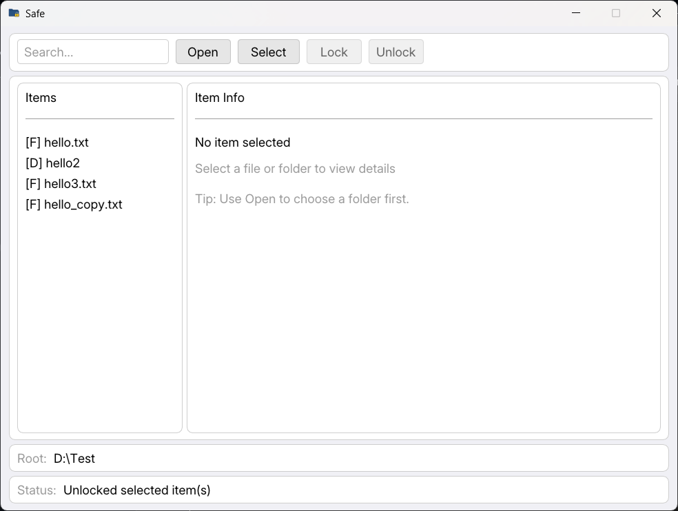
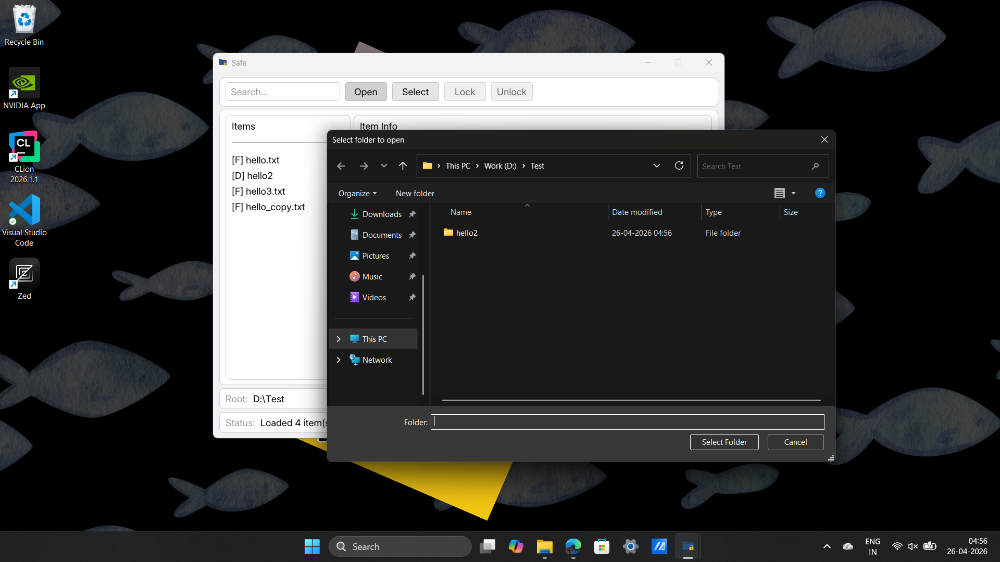
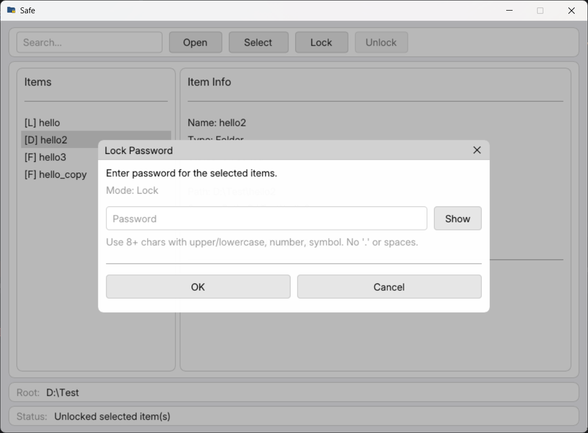
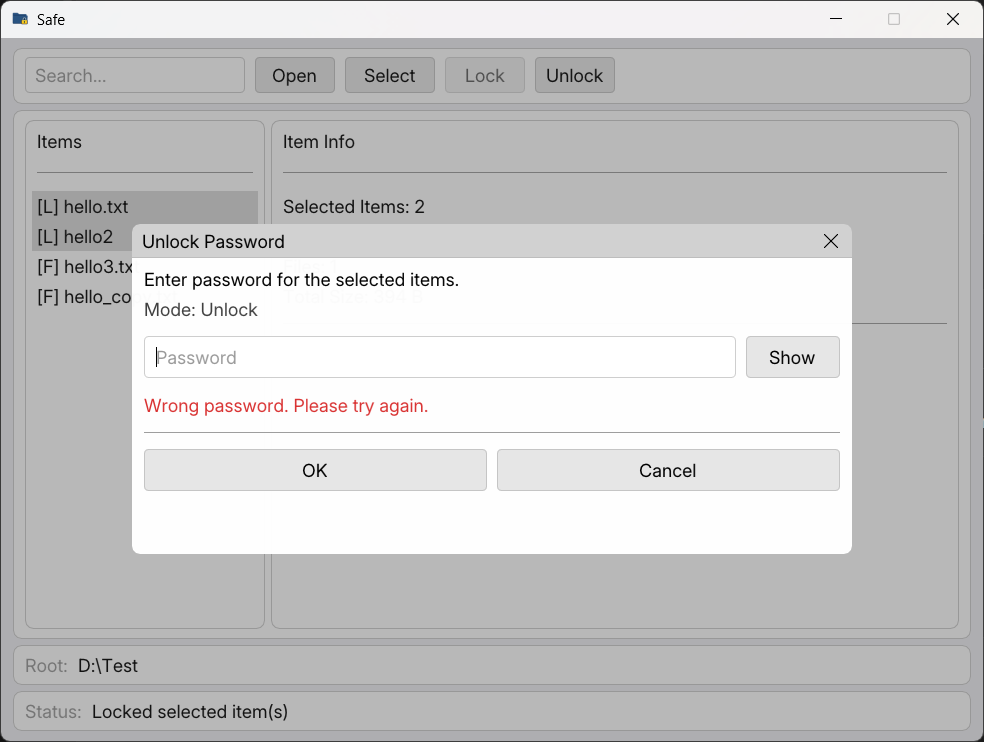

# Safe

Safe is a Windows desktop app for locking and unlocking files/folders into encrypted `.safe` archives.

## Project status

- Current app version: `1.1.2`
- Core workflow is implemented: open folder, browse/search, lock, unlock, and persist metadata/state.

## Features

1. Full-screen Dear ImGui UI (TopBar, Sidebar, MainPanel, StatusBar)
2. Selection modes: single click, Select mode, Ctrl+Click toggle, Shift+Click range
3. Lock/Unlock for selected items or focused item
4. Live refresh while opened root remains active
5. Metadata persistence in `%LOCALAPPDATA%\Safe\safe.db`
6. Last opened root path restored on startup

## Technology stack

1. C++20
2. CMake + Ninja
3. Win32 API
4. DirectX 11
5. Dear ImGui (Win32 + DX11 backends)
6. SQLite3
7. Windows BCrypt

## OpenSSL runtime DLLs (`core\build`)

Required DLLs:

1. `libcrypto-3-x64.dll`
2. `libssl-3-x64.dll`

Setup:

1. Install OpenSSL 3.x (Win64)
2. Copy both DLLs into `core\build\`
3. Configure:
   - `cmake -S . -B release-build -G Ninja -DOPENSSL_DLL_DIR="core\build"`
4. Build:
   - `cmake --build release-build`

## Usage

### Open folder

1. Launch the app.
2. Click **Open**.
3. Choose a root folder.

### Lock

1. Select unlocked item(s).
2. Click **Lock**.
3. Enter password.

### Unlock

1. Select locked item(s).
2. Click **Unlock**.
3. Enter the original lock password.

### Search and details

1. Use the **Search...** box to filter by name.
2. The right panel shows metadata (type, status, size, path, source path, modified time).

## UI preview

## Build installer (per-user)

1. Install **Inno Setup 6** (`ISCC.exe`).
2. Configure and build:
   - `cmake -S . -B debug-build`
   - `cmake --build debug-build --config Release --target installer`
3. Output:
   - `debug-build\installer\safe.exe`

Installer behavior:

- Per-user install (`PrivilegesRequired=lowest`) to `%LOCALAPPDATA%\Programs\Safe`
- Adds install directory to current user `PATH`
- Uninstall removes that `PATH` entry
- Uninstall removes installed app files but keeps `.safe` archives
- Uninstall prompts to optionally remove `%LOCALAPPDATA%\Safe` data (including `safe.db`)
